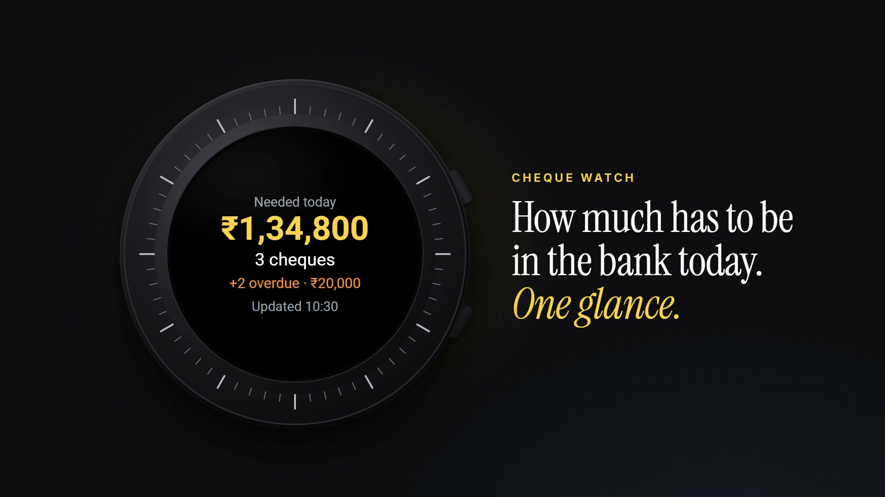

# Cheque Watch

[](docs/demo.mp4)

<sub>▶ Click the image for the 22-second demo video. It uses demo data, not real cheques.</sub>

A small, **read-only** Wear OS companion for [Cheque Tracker](https://github.com/vikashpatel04/Cheque-Tracker).
It shows how much money has to be in the bank for **today's cheques**, on a watch tile and in a tiny app.

- **Tile:** "Needed today ₹1,25,000 · 5 cheques · +2 overdue · ₹30,000 · Updated 10:30"
- **App:** today's list, with party, amount and status, and a view-only detail screen
- **View-only:** there's no way to edit, deposit or change status from the watch
- **Easy on battery:** one fetch per hour, and the tile never touches the network
- **Runs on its own:** sideloaded with ADB; no Play Store, no phone app

Built and used on a Galaxy Watch4 Classic. It should work on any Wear OS 3+ watch.

## How it works

```
Watch (tile + app)  ──GET, x-watch-key──►  Supabase Edge Function "watch-today"  ──SELECT──►  Cheque Tracker DB
   caches JSON in DataStore                 fixed read-only queries, today in IST
```

The Edge Function runs in **your** Cheque Tracker Supabase project. It uses the database connection Supabase gives every function, so no SQL setup or database password is needed. It only reads `cheques` and `parties`, and doesn't change the web app's schema.

### What counts as "today"

It matches the web app's dashboard (`TodayPanel`):

| | Rule |
|---|---|
| Today's list | `due_date` = today (Asia/Kolkata), status **Pending** or **Deposited**, not deleted. Largest amount first. |
| **Needed today** | Sum of today's **Pending** cheques only. A Deposited cheque is already covered, so it's listed but not counted, as in the web app's "Cash needed today". |
| Count | All cheques in today's list, Pending and Deposited. |
| Overdue | `due_date` before today, Pending or Deposited. Shows how many there are and the amount of the Pending ones. |

API response (`GET /functions/v1/watch-today`, header `x-watch-key`):

```json
{
  "date": "2026-09-25",
  "amount_needed": 134800,
  "count": 3,
  "overdue_count": 2,
  "overdue_amount_needed": 20000,
  "updated_at": "2026-09-25T07:05:39.975Z",
  "cheques": [
    { "id": "…", "party_name": "Sharma Traders", "amount": 125000, "status": "PENDING",
      "cheque_number": "100234", "bank_name": "SBI", "due_date": "2026-09-25",
      "original_due_date": null, "represent_count": 0, "return_reason": null }
  ]
}
```

### Compatibility

The function reads the following columns. Nothing else is read, and nothing is ever written.

| Table | Columns |
|---|---|
| `cheques` | id, user_id, party_id, cheque_number, bank_name, amount, due_date, status, original_due_date, represent_count, return_reason, deleted_at |
| `parties` | id, name |

`original_due_date` and `represent_count` come from Cheque Tracker's migration `009_represent_writeoff_rollback.sql`. If your install is older, apply the web app's migrations first, or the function returns `500 Query failed`. Status labels and colors follow the web app: Pending, Deposited, Passed, Returned, Cancelled, Written Off.

## Requirements

- A deployed [Cheque Tracker](https://github.com/vikashpatel04/Cheque-Tracker) with its Supabase project
- [Android Studio](https://developer.android.com/studio), for the Android SDK and its bundled JDK
- [Node.js](https://nodejs.org), used to run the Supabase CLI through `npx`
- On Windows, [Git for Windows](https://git-scm.com/download/win), which provides Git Bash
- A Wear OS watch on the same Wi-Fi as your computer (only needed during install)

## Setup

Clone the repo, then run the setup script from its folder:

| OS | Command |
|---|---|
| Windows (PowerShell or cmd) | `.\setup.cmd` |
| macOS, Linux, Git Bash | `bash setup.sh` |

The script asks for a few things along the way:

1. **Project ref:** the `xxxx` in `https://xxxx.supabase.co`.
2. **Supabase login:** approve it in the browser window that opens.
3. **More than one login?** If your Cheque Tracker has several users, give the user id whose cheques the watch should show (Dashboard → Authentication → Users). It's saved as `WATCH_USER_ID`.
4. **The watch:** the script shows these steps:
   - enable Developer options (usually Settings → About watch → Software information → tap **Software version** 7 times)
   - turn on **ADB debugging** and **Wireless debugging**
   - open **Pair new device** and type the IP:port and code it shows into the script

   Keep the watch screen on while pairing. The code stops working once the popup closes.

Everything else is automatic:
- generating a random watch key
- saving it as a Supabase secret
- deploying the function
- testing it (a 200 response, and a 401 without the key)
- writing `watch-app/local.properties`
- building the release APK (about 3 MB)
- installing it

**Afterwards:**
- Turn **Wireless debugging** and **ADB debugging** off on the watch.
- Open the **Cheques** app once.
- **Add the tile:** swipe to your tiles, long-press one, scroll to the end, tap **+**, and choose **Today's cheques**.

**If only the install failed**, for example at pairing, run `.\setup.cmd install` or `bash setup.sh install` to retry just that step.

<details>
<summary>Manual setup (without the script)</summary>

```bash
# 1. Secret + deploy
npx supabase login
npx supabase secrets set --project-ref <ref> WATCH_KEY=<long random string>
npx supabase functions deploy watch-today --project-ref <ref> --no-verify-jwt --use-api

# 2. Test (expect 200, then 401)
curl -i -H "x-watch-key: <key>" https://<ref>.supabase.co/functions/v1/watch-today
curl -i https://<ref>.supabase.co/functions/v1/watch-today

# 3. Build: create watch-app/local.properties (see local.properties.example), then
cd watch-app && ./gradlew assembleRelease

# 4. Install
adb pair <ip>:<pairing-port>          # enter the code
adb connect <ip>:<port>
adb install -r app/build/outputs/apk/release/app-release.apk
```

`--no-verify-jwt` is needed because the watch authenticates with `x-watch-key`, not a Supabase login. Gradle needs Java 17+; Android Studio's bundled JDK works, so set `JAVA_HOME` to it if `java -version` is older.
</details>

## Updating

- **Data:** updates on its own.
  - about every hour when the watch has a connection
  - just after midnight IST
  - whenever you open the app or tap **Refresh**

  The tile redraws after each fetch.
- **The app:** there's no Play Store, so pull the latest code and run the setup again. It reuses your key, redeploys, rebuilds and reinstalls, and your tile stays.
- **Signing:** APKs are signed with your computer's Android debug key. Keep building on the same computer, or uninstall the app before installing a build made elsewhere.

## Battery

- **Background:** one WorkManager job per hour, only when a network is available, plus one at about 00:05 IST so yesterday's data clears. Failed fetches aren't retried in a loop.
- **The tile** only reads the local cache and never uses the network.
- **Opening the app** fetches once. Waking the screen over the open app doesn't fetch again within 2 minutes.
- **Nothing else runs:** no foreground service, no polling, no wake locks of its own, and no location or sensors. It uses the default network, normally the phone's Bluetooth proxy. Wi-Fi is never forced on.

## Security

- **The function only reads:**
  - it answers only GET requests with the right `x-watch-key` (401 otherwise, 405 for other methods)
  - it runs two fixed SELECT queries inside a READ ONLY transaction, which Postgres itself enforces
  - it takes no input from the request apart from the key
- **The watch key is compiled into the APK.** Don't share your APK.
- **To rotate the key:** delete `watch.key` from `watch-app/local.properties` and run the setup again.
- **Secrets never go in git.** `local.properties`, `.env*` and `supabase/.temp/` are git-ignored.

## Customising

- **Time zone:** Asia/Kolkata is set in `supabase/functions/watch-today/index.ts` (`TIME_ZONE`) and `watch-app/.../data/Format.kt` (`IST`).
- **Currency format:** Indian grouping (₹1,25,000) is in `formatInr` in `Format.kt`.
- **Refresh interval:** set in `watch-app/.../work/RefreshWork.kt`. WorkManager's minimum is 15 minutes; more often costs battery.

## Project layout

```
setup.sh, setup.cmd              one-shot setup (deploy, test, build, install)
supabase/functions/watch-today/  Edge Function (Deno + postgres.js)
supabase/config.toml             verify_jwt = false for watch-today
watch-app/                       Android Studio project
  app/src/main/java/.../data     API client, DataStore cache, formatting
  app/src/main/java/.../tile     Tile (ProtoLayout), renders from cache
  app/src/main/java/.../ui       Compose for Wear OS (Material 3) screens
  app/src/main/java/.../work     WorkManager hourly + midnight refresh
```

**Tech:**
- Kotlin, Compose for Wear OS Material 3, Tiles and ProtoLayout
- OkHttp, kotlinx.serialization, DataStore and WorkManager
- minSdk 30

## Development

**Watch app:**
```bash
cd watch-app && ./gradlew lintDebug testDebugUnitTest assembleDebug
```

**Edge Function:**
```bash
deno check supabase/functions/watch-today/index.ts
```
To run it locally against a Postgres copy of the Cheque Tracker schema:
```bash
SUPABASE_DB_URL=postgres://… WATCH_KEY=test deno run -A supabase/functions/watch-today/index.ts
```

CI (`.github/workflows/build.yml`) lints and builds the app, runs the unit tests and type-checks the function. Dependabot proposes dependency updates once a month.

Issues and pull requests are welcome. Please keep it read-only and light on battery.

## License

[MIT](LICENSE)
